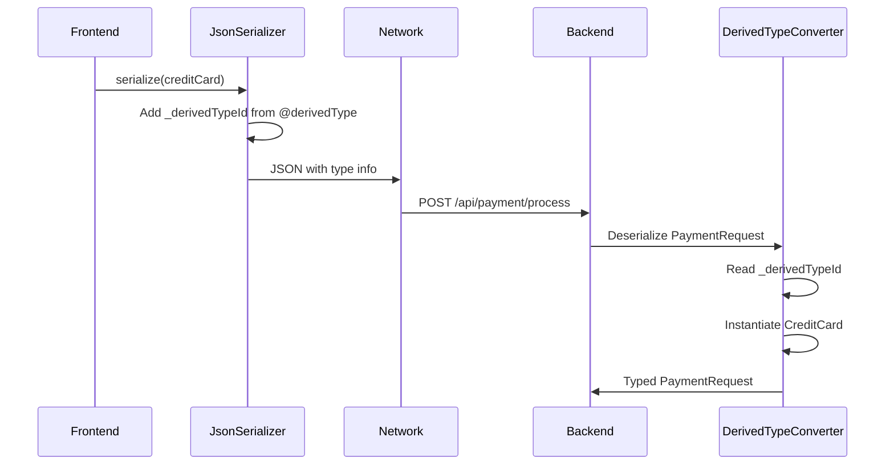
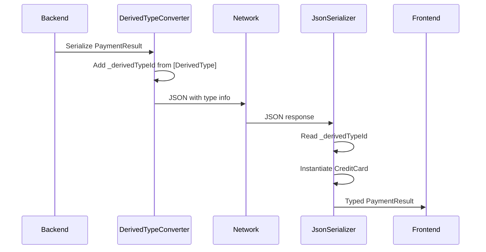

# DerivedTypes Integration: Backend and Frontend

This document explains how the DerivedTypes serialization systems in the .NET backend and TypeScript frontend work together to provide seamless polymorphic serialization across your full-stack application.

## Overview

The DerivedTypes system creates a bridge between strongly-typed C# classes and TypeScript classes, enabling type-safe polymorphic serialization across the client-server boundary. Both systems use identical JSON representations and type identifiers to ensure compatibility.

## Shared Concepts

### Unique Type Identifiers

Both backend and frontend use GUID-based identifiers that must match exactly:

**Backend (.NET)**:

```csharp
[DerivedType("550e8400-e29b-41d4-a716-446655440001")]
public class CreditCard : IPaymentMethod
{
    public decimal Amount { get; set; }
    public string CardNumber { get; set; }
}
```

**Frontend (TypeScript)**:

```typescript
@derivedType('550e8400-e29b-41d4-a716-446655440001')
export class CreditCard implements IPaymentMethod {
    @field(Number)
    amount!: number;
    
    @field(String)
    cardNumber!: string;
}
```

### JSON Wire Format

Both systems produce and consume identical JSON:

```json
{
  "paymentMethod": {
    "amount": 99.99,
    "cardNumber": "****-1234",
    "_derivedTypeId": "550e8400-e29b-41d4-a716-446655440001"
  }
}
```

The `_derivedTypeId` property is the key that allows both systems to:

1. **Identify the correct type** during deserialization
2. **Instantiate the proper class** instead of a generic object
3. **Maintain type safety** throughout the serialization process

## Full-Stack Example

Let's walk through a complete example showing data flow from backend to frontend and back.

### 1. Backend API Endpoint

```csharp
[ApiController]
[Route("api/[controller]")]
public class PaymentController : ControllerBase
{
    [HttpPost("process")]
    public ActionResult<PaymentResult> ProcessPayment([FromBody] PaymentRequest request)
    {
        // request.PaymentMethod will be properly deserialized to CreditCard or PayPal
        var result = _paymentService.ProcessPayment(request.PaymentMethod);
        
        return Ok(new PaymentResult
        {
            Success = result.Success,
            PaymentMethod = request.PaymentMethod // Will serialize with _derivedTypeId
        });
    }
    
    [HttpGet("methods")]
    public ActionResult<IEnumerable<IPaymentMethod>> GetAvailablePaymentMethods()
    {
        return Ok(new IPaymentMethod[]
        {
            new CreditCard { Amount = 0, CardNumber = "Demo" },
            new PayPal { Amount = 0, Email = "demo@example.com" }
        });
    }
}
```

### 2. Shared Models

**Backend Models**:
```csharp
public interface IPaymentMethod
{
    decimal Amount { get; set; }
}

[DerivedType("550e8400-e29b-41d4-a716-446655440001")]
public class CreditCard : IPaymentMethod
{
    public decimal Amount { get; set; }
    public string CardNumber { get; set; }
    public string ExpiryDate { get; set; }
}

[DerivedType("550e8400-e29b-41d4-a716-446655440002")]
public class PayPal : IPaymentMethod
{
    public decimal Amount { get; set; }
    public string Email { get; set; }
}

public class PaymentRequest
{
    public string OrderId { get; set; }
    public IPaymentMethod PaymentMethod { get; set; }
}

public class PaymentResult
{
    public bool Success { get; set; }
    public IPaymentMethod PaymentMethod { get; set; }
}
```

**Frontend Models** (mirroring backend):
```typescript
export interface IPaymentMethod {
    amount: number;
}

@derivedType('550e8400-e29b-41d4-a716-446655440001')
export class CreditCard implements IPaymentMethod {
    @field(Number)
    amount!: number;
    
    @field(String)
    cardNumber!: string;
    
    @field(String)
    expiryDate!: string;
}

@derivedType('550e8400-e29b-41d4-a716-446655440002')
export class PayPal implements IPaymentMethod {
    @field(Number)
    amount!: number;
    
    @field(String)
    email!: string;
}

export class PaymentRequest {
    @field(String)
    orderId!: string;
    
    @field(Object, false, [CreditCard, PayPal])
    paymentMethod!: IPaymentMethod;
}

export class PaymentResult {
    @field(Boolean)
    success!: boolean;
    
    @field(Object, false, [CreditCard, PayPal])
    paymentMethod!: IPaymentMethod;
}
```

### 3. Frontend Usage

```typescript
class PaymentService {
    async processPayment(paymentMethod: IPaymentMethod): Promise<PaymentResult> {
        const request = new PaymentRequest();
        request.orderId = '12345';
        request.paymentMethod = paymentMethod;
        
        // Serialize with type information
        const json = JsonSerializer.serialize(request);
        
        const response = await fetch('/api/payment/process', {
            method: 'POST',
            headers: { 'Content-Type': 'application/json' },
            body: json
        });
        
        const responseJson = await response.text();
        
        // Deserialize with proper types
        return JsonSerializer.deserialize(PaymentResult, responseJson);
    }
    
    async getAvailablePaymentMethods(): Promise<IPaymentMethod[]> {
        const response = await fetch('/api/payment/methods');
        const json = await response.text();
        
        // Each item will be properly typed as CreditCard or PayPal
        return JsonSerializer.deserializeArray(Object, json)
            .map(item => {
                // The JsonSerializer will have already created the correct instances
                return item as IPaymentMethod;
            });
    }
}

// Usage in component
const paymentService = new PaymentService();

// Create a CreditCard payment
const creditCard = new CreditCard();
creditCard.amount = 99.99;
creditCard.cardNumber = '1234-5678-9012-3456';
creditCard.expiryDate = '12/25';

// Process the payment - types are preserved throughout
const result = await paymentService.processPayment(creditCard);

// result.paymentMethod will be a CreditCard instance
if (result.paymentMethod instanceof CreditCard) {
    console.log(`Processed card ending in ${result.paymentMethod.cardNumber.slice(-4)}`);
}
```

## Data Flow

### 1. Frontend to Backend (Serialization)



### 2. Backend to Frontend (Deserialization)



## Configuration

### Backend Configuration

```csharp
// In Program.cs or Startup.cs
services.Configure<JsonSerializerOptions>(options =>
{
    options.Converters.Add(new DerivedTypeJsonConverterFactory());
    options.PropertyNamingPolicy = JsonNamingPolicy.CamelCase; // Match frontend
});

// The DerivedTypes system is automatically registered as a singleton
services.AddSingleton<IDerivedTypes, DerivedTypes>();
```

### Frontend Configuration

```typescript
// Ensure reflect-metadata is imported early
import 'reflect-metadata';

// Configure TypeScript
// tsconfig.json
{
  "compilerOptions": {
    "experimentalDecorators": true,
    "emitDecoratorMetadata": true
  }
}
```

## Best Practices for Full-Stack Integration

### 1. Synchronized Type Definitions

Maintain a shared understanding of types:

```typescript
// Consider generating TypeScript models from C# classes
// Or maintain parallel class definitions with identical structures
```

### 2. Consistent Naming Conventions

Configure JSON serialization to use consistent casing:

**Backend**:
```csharp
options.PropertyNamingPolicy = JsonNamingPolicy.CamelCase;
```

**Frontend**:
```typescript
// Field decorators already use camelCase property names
@field(String)
cardNumber!: string; // Serializes as "cardNumber"
```

### 3. Version Management

Use meaningful version identifiers for evolution:

```csharp
[DerivedType("creditcard-v1-550e8400-e29b-41d4-a716-446655440001")]
public class CreditCard : IPaymentMethod { }

[DerivedType("creditcard-v2-550e8400-e29b-41d4-a716-446655440002")]
public class CreditCardV2 : IPaymentMethod { }
```

### 4. Error Handling

Handle deserialization failures gracefully:

**Frontend**:
```typescript
try {
    const result = JsonSerializer.deserialize(PaymentResult, json);
    return result;
} catch (error) {
    console.error('Failed to deserialize payment result:', error);
    // Handle unknown types or malformed data
    return null;
}
```

**Backend**:
```csharp
try
{
    var request = JsonSerializer.Deserialize<PaymentRequest>(json, options);
    return request;
}
catch (JsonException ex)
{
    _logger.LogError(ex, "Failed to deserialize payment request");
    return BadRequest("Invalid request format");
}
```

### 5. Testing Integration

Test the complete round-trip:

```typescript
describe('Payment integration', () => {
    it('should handle credit card round-trip', async () => {
        // Create frontend object
        const originalCard = new CreditCard();
        originalCard.amount = 99.99;
        originalCard.cardNumber = '1234';
        
        // Serialize for backend
        const json = JsonSerializer.serialize(originalCard);
        
        // Simulate backend processing (you might use a real API in integration tests)
        const backendResponse = await simulateBackendProcessing(json);
        
        // Deserialize backend response
        const result = JsonSerializer.deserialize(PaymentResult, backendResponse);
        
        // Verify type preservation
        expect(result.paymentMethod instanceof CreditCard).toBe(true);
        expect((result.paymentMethod as CreditCard).cardNumber).toBe('1234');
    });
});
```

## Common Pitfalls

### 1. Mismatched Type IDs

**Problem**: Frontend and backend have different GUIDs for the same type.
**Solution**: Use shared constants or code generation.

### 2. Missing Derivatives Lists

**Problem**: Frontend field decorators missing derivatives parameter.
**Solution**: Always specify derivatives for polymorphic fields.

### 3. Case Sensitivity

**Problem**: Property names don't match between frontend and backend.
**Solution**: Configure consistent casing policies.

### 4. Missing Field Decorators

**Problem**: TypeScript properties without `@field` decorators aren't serialized.
**Solution**: Decorate all serializable properties.

### 5. Type Registration Order

**Problem**: Derived types not registered before serialization.
**Solution**: Ensure all classes are imported before use.

## Debugging

### Backend Debugging

```csharp
// Check if a type is registered
var derivedTypes = serviceProvider.GetService<IDerivedTypes>();
var isRegistered = derivedTypes.IsDerivedType(typeof(CreditCard));

// Get target type for derived type
var targetType = derivedTypes.GetTargetTypeFor(typeof(CreditCard));
```

### Frontend Debugging

```typescript
// Check derived type registration
const derivedTypeId = DerivedType.get(CreditCard);
console.log('CreditCard ID:', derivedTypeId);

// Check field metadata
const fields = Fields.getFieldsForType(PaymentRequest);
console.log('PaymentRequest fields:', fields);

// Inspect JSON before sending
const json = JsonSerializer.serialize(paymentRequest);
console.log('Outgoing JSON:', json);
```

This integration enables robust, type-safe communication between your .NET backend and TypeScript frontend while maintaining the flexibility of polymorphic serialization.
